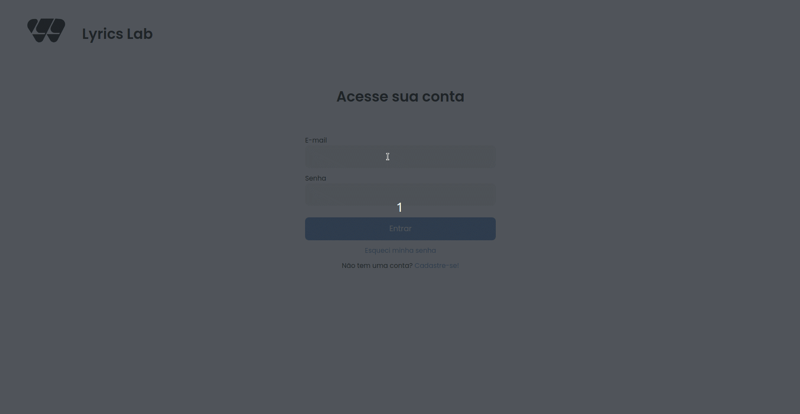

   
<h1>Lyrics Lab</h1>

O lyrics lab é um projeto para compositores de músicas que procuram um lugar para criar e armazenar as suas cifras.

### Para rodar o projeto é necessario ter instalado na sua máquina:
* Node
* Dotnet

Caso não tenha o node instalado na sua máquina visite esse site: https://nodejs.org/en/download/package-manager

Caso não tenha o dotnet, visite este site: https://learn.microsoft.com/pt-br/dotnet/core/install/windows

### Como rodar localmente
#### **1. Clone o projeto backEnd**
    git clone https://github.com/Ramon-Mateus/Lyrics-Lab-API.git

#### **2. Entre na pasta da api**
    cd Lyrics-Lab-API/Lyrics_Lab/
#### **3. Rode a API localmente**
    dotnet run
#### **4. Clone o projeto frontEnd**
    git clone https://github.com/RafaelFernandes12/lyrics_lab_front_end.git
#### **5. Entre na pasta do frontEnd**
    cd lyrics_lab_front_end/
#### **6. Rode o projeto localmente**
    npm run dev

## O Lyrics Lab foi feito em:
* Next js
* Typescript 
* Tailwind css
* Material UI
* Axios
* Firebase